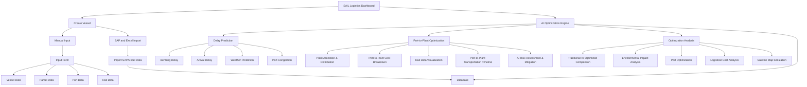

# 🚢 SAIL Logistics Optimizer

> **Quantum Quorum** - Smart India Hackathon 2025

An AI-powered logistics optimization platform designed to revolutionize supply chain management for the steel industry. This comprehensive solution leverages machine learning, blockchain technology, and real-time analytics to minimize costs, eliminate inefficiencies, and enhance operational reliability.

---

## 🎯 Overview

SAIL Logistics is an intelligent logistics optimization engine that addresses critical challenges in supply chain management for the steel sector. By integrating AI-driven optimization, blockchain transparency, and predictive analytics, the platform delivers:

- **4,000+ hours** saved annually through automation
- **50-70% faster** decision-making compared to manual processes
- Real-time supply chain visibility and control
- Enhanced operational efficiency and reliability

---

## ✨ Key Features

### 🤖 AI Vessel-to-Plant Orchestration
- **Intelligent Optimization**: ML algorithms optimize vessel, berth, rail, and rake allocations
- **Sequential Discharge**: Removes bottlenecks across ports/plants through smart sequencing
- **Real-time Coordination**: Synchronizes vessel arrivals with plant capacity and material flow

### � Analytics & Optimization Dashboard
- **Live Tracking**: Real-time display of efficiency gains and performance metrics
- **Comprehensive Analytics**: Optimizes freight, port, rail, and storage operations
- **Predictive Insights**: Forecasts plant demand and syncs material flow to reduce holding time

### 🔗 Blockchain Transparency & Compliance
- **Tamper-proof Records**: Immutable shipment, discharge, and rail records
- **ESG Compliance**: Ensures regulatory adherence and builds supplier/stakeholder trust
- **Full Traceability**: End-to-end visibility across the supply chain

### 📊 Scenario Simulation & Planning
- **Disruption Modeling**: Simulates strikes, weather events, demand spikes, and route changes
- **Resilient Planning**: Provides fallback strategies and contingency plans
- **Risk Assessment**: AI-based risk evaluation and mitigation strategies

### 🔮 Predictive Congestion Control
- **Real-time Monitoring**: Tracks berth, rail, and weather conditions with ML forecasts
- **Auto-rerouting**: Prevents supply chain delays through intelligent rescheduling
- **Traffic Optimization**: Manages port queues and rail traffic efficiently

### 📈 Market Intelligence & Negotiation
- **Price Forecasting**: Predicts supplier/country prices to aid negotiation
- **Contract Optimization**: Suggests best timing and deal strategies
- **Inventory Management**: Forecasts supply prices and freight rates

### 🗺️ Interactive Satellite Map Visualization
- **Geographic Insights**: Real-time visualization of vessels, ports, and plants
- **Route Planning**: Visual representation of optimal transportation routes
- **Geospatial Analytics**: Location-based decision support

### 🔄 Legacy Integration (SAP/Excel)
- **Seamless Import**: Imports SAP & Excel records without disruption
- **AI Conversion**: Converts legacy data into actionable AI insights
- **Zero Downtime**: Maintains business continuity during integration

---

## 🛠️ Technology Stack

### Backend
- **Node.js** - Runtime environment
- **Express.js** - Web application framework
- **Python** - AI/ML model development
- **Flask** - Microservices and ML API endpoints

### Frontend
- **JavaScript** - Interactive UI components
- **Modern Web Technologies** - Responsive design

### Database
- **MongoDB** - NoSQL database for flexible data storage
- **Machine Learning Models** - Predictive analytics engine

### AI/ML
- **Gemini AI** - Advanced AI capabilities
- **Custom ML Models** - Delay prediction, congestion forecasting, optimization algorithms

### Additional Technologies
- **Blockchain** - Distributed ledger for transparency
- **Satellite APIs** - Real-time geospatial data
- **Weather APIs** - Environmental condition monitoring

---

## 🏗️ System Architecture



---

## 🔧 Core Modules

### 1. Vessel Creation & Data Management
- Manual input forms for vessel, parcel, port, and rail data
- Automated SAP/Excel data import and conversion
- Centralized database for all logistics information

### 2. AI-Powered Prediction Engine
- **Berthing Delay Prediction**: Forecasts port delays
- **Arrival Delay Prediction**: Estimates vessel arrival times
- **Weather Prediction**: Integrates meteorological data
- **Port Congestion Prediction**: Anticipates bottlenecks

### 3. Optimization Module
- **Plant Allocation**: Intelligent distribution of materials
- **Cost Breakdown**: Detailed port-to-plant cost analysis
- **Rail Optimization**: Efficient rake scheduling
- **Transportation Timeline**: End-to-end journey planning
- **Risk Mitigation**: AI-based risk assessment

### 4. Analytics & Visualization
- Traditional vs. optimized comparison dashboards
- Environmental impact analysis
- Port optimization metrics (single & sequential)
- Logistical cost analysis
- Interactive satellite map simulation

---

## 📊 Impact & Benefits

### Key Performance Improvements

| Metric | Value |
|--------|-------|
| **Time Efficiency Gains** | 4,000+ hours annually |
| **Decision Speed Improvement** | 50-70% faster than manual processes |
| **Carbon Emission Reduction** | 2.5 lakh tonnes yearly |
| **Automation Level** | Thousands of staff hours saved |

### Transformational Benefits

1. **💡 Eliminate Inefficiency**
   - Unlock significant operational improvements through phased AI optimization

2. **⚡ Instant AI-Driven Adjustments**
   - Go from planning delays to instant, AI-driven supply chain adjustments for faster shipments and fewer bottlenecks

3. **⏱️ Automation of Manual Processes**
   - Save thousands of staff hours each year by automating manual scheduling and paperwork

4. **🎯 Real-time Alignment**
   - Achieve real-time alignment from vessel arrival to finished steel dispatch, boosting plant output reliability

5. **🌱 Carbon Emission Reduction**
   - Cut carbon emissions by 2.5 lakh tonnes yearly and secure ESG certifications through sustainable traceability

6. **🛡️ Disruption Prediction**
   - Predict and overcome disruptions like strikes, weather, and volatility with smart scenario planning and fallback strategies

7. **📋 Procurement Efficiency**
   - Enhance procurement efficiency by optimizing material selection and contract timing with AI analytics

---

## 🔍 Feasibility & Viability

### Competitive Advantage

| Feature | SAIL Logistics | SAP TM | Oracle SCP | Blue Yonder | FourKite |
|---------|----------------|--------|------------|-------------|----------|
| **AI-Driven Vessel & Rail Scheduling** | ✅ | ❌ | ❌ | ❌ | ❌ |
| **Congestion Forecasting** | ✅ | ❌ | ❌ | ✅ | ✅ |
| **Interactive Satellite Map** | ✅ | ❌ | ❌ | ❌ | ❌ |
| **SAP/Excel Integration** | ✅ | ✅ | ❌ | ❌ | ❌ |
| **Live ROI Dashboard** | ✅ | ❌ | ❌ | ✅ | ❌ |
| **End-to-End Cost Optimization** | ✅ | ❌ | ✅ | ❌ | ❌ |

### Risk Mitigations

- **Data Reliability**: AI cleansing, backups, and fallback ensure consistent accuracy
- **Adoption Management**: Phased rollout with user training minimizes resistance
- **Security Protection**: Encryption, blockchain trails, and monitoring safeguard data
- **Performance Assurance**: Cloud auto-scaling manages peak loads and crises
- **Continuous Innovation**: ML models evolve with changing logistics dynamics

### Viability Factors

- **High Demand**: Steel sector requires automation for competitiveness
- **Scalability Potential**: Easily replicable across other industries
- **Regulatory Compliance**: Keeps up with changing regulations
- **Sustainable**: Revenue through licensing and industry-wide expansion
- **Partnerships**: Foundation for collaboration with ports, railways, and shipping companies

---

## 🚀 Installation

### Prerequisites

- Node.js (v14 or higher)
- Python (v3.8 or higher)
- MongoDB (v4.4 or higher)
- npm or yarn package manager

### Backend Setup

```bash
# Navigate to backend directory
cd backend

# Install dependencies
npm install

# Set up environment variables
cp .env.example .env
# Edit .env with your configuration

# Start the backend server
npm start
```

### Frontend Setup

```bash
# Navigate to frontend directory
cd frontend

# Install dependencies
npm install

# Set up environment variables
cp .env.example .env
# Edit .env with your configuration

# Start the development server
npm run dev
```

### Python ML Services

```bash
# Install Python dependencies
pip install -r requirements.txt

# Start ML services
python app.py
```

---

## 💻 Usage

### Accessing the Dashboard

1. Open your browser and navigate to `http://localhost:3000`
2. Log in with your credentials
3. Access the main SAIL Logistics Dashboard

### Creating a Vessel Entry

1. Navigate to **Create Vessel** section
2. Choose between:
   - **Manual Input**: Fill in vessel, parcel, port, and rail data
   - **SAP/Excel Import**: Upload existing data files
3. Submit the form to add vessel to the system

### Running Optimization

1. Select vessels and routes for optimization
2. Configure optimization parameters
3. Run AI optimization engine
4. Review results in the analytics dashboard

### Viewing Analytics

- **Cost Dashboard**: Real-time cost savings and ROI metrics
- **Predictive Analytics**: Delay predictions and congestion forecasts
- **Satellite Map**: Geographic visualization of logistics network
- **Comparison View**: Traditional vs. optimized approach analysis

---

## 📁 Project Structure

```
Logistics-Optimizer/
├── backend/                 # Node.js/Express backend
│   ├── controllers/        # Route controllers
│   ├── models/            # Database models
│   ├── routes/            # API routes
│   ├── services/          # Business logic
│   └── server.js          # Entry point
│
├── frontend/               # Frontend application
│   ├── src/
│   │   ├── components/    # React components
│   │   ├── pages/         # Page components
│   │   ├── services/      # API services
│   │   └── utils/         # Utility functions
│   └── public/            # Static assets
│
├── ml-services/           # Python ML services
│   ├── models/           # ML models
│   ├── prediction/       # Prediction algorithms
│   └── optimization/     # Optimization algorithms
│
├── sail_data_new.csv     # Sample logistics data
└── README.md             # This file
```

---

## 🤝 Contributing

We welcome contributions to the SAIL Logistics Optimizer project! Please follow these guidelines:

1. Fork the repository
2. Create a feature branch (`git checkout -b feature/AmazingFeature`)
3. Commit your changes (`git commit -m 'Add some AmazingFeature'`)
4. Push to the branch (`git push origin feature/AmazingFeature`)
5. Open a Pull Request

---

## 📄 License

This project is developed for Smart India Hackathon 2025 by Team **Quantum Quorum**.

---

## 🔗 Links

- **Website**: [SAIL Logistics](https://sail-logistics.example.com)
- **Video Presentation**: [Watch Demo](https://video-presentation-link.example.com)
- **Prototype**: [Try Live Demo](https://prototype-link.example.com)

---

## 👥 Team

**Quantum Quorum** - Smart India Hackathon 2025

---

## 📞 Contact

For questions, suggestions, or collaboration opportunities, please reach out to the development team.

---

<div align="center">

**Made with ❤️ for Smart India Hackathon 2025**

*Transforming Logistics Through AI & Innovation*

</div>
